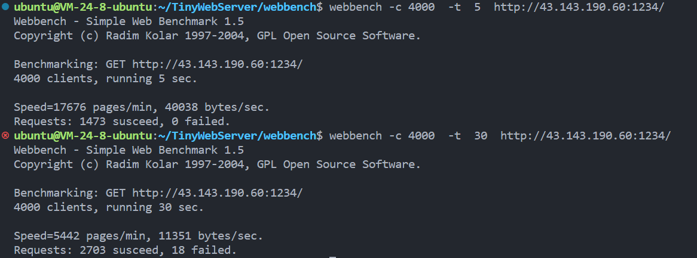

# mywebserver

 一个c++编写的运行在linux上的服务器
根据进度更新版本

相关讲解在[我的博客](https://waterkin.top/categories/webserver/)上有，但还没更新完

# 0.1

只有线程池，epoll相关，但后续发现有些错误，这版可信度不高

# 1.0

基本完善一个服务器的功能，包含http处理，定时器自动断开超时连接等功能，但仍然可能存在bug

目前经过webbench测试，能通过4000并发的测试，但再往上会出现服务器崩溃的情况

> 我觉得可能程序也有问题，但我用的腾讯云轻量服务器也是一个问题，去查看cpu占比已经到65%了，我觉得服务器性能再好一点，并发数会高一点

长时间的4000并发会出现部分错误，但服务器不会崩溃，再往上就直接强行被kill了

# 1.1

更新了日志功能，但测试还是没开日志，日志打开确实会导致运行变慢很多，除非调试，不推荐长时间开启

日志的内容可能不是很规范，我并不清楚一个规范的服务器日志该怎么写，后续有空可能会尝试更改

对整个项目的结构重新更改了，感觉更加清晰了，所有设置都放在setting.h内，方便进行更改
